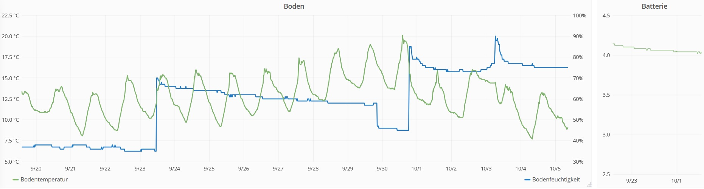

# LoRa Soil Moisture Sensor   

A capacitive soil moisture sensor that reports the values over TTN 

# Prerequisites

- an [Adafruit Feather Lora](https://www.adafruit.com/product/3178) or Chinese clon called LoRa32u4 II 
- a [capacitive soil moisture sensor](https://www.tindie.com/products/miceuz/i2c-soil-moisture-sensor/)
- 2x 3.3kOhm resistors (pullup for SDA and SCL)
- battery and battery holder. I used a holder for one 18650 LiPo
- and a housing

...that's all

